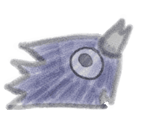

# KawkawInChat

A recreation of the Kawkaw encounter from Deltarune Chapter 5. Let Twitch chat
engage with the stream by letting Kawkaw lick you on your face; Or play with 
its feeling and make it cry.


- **!kawkaw** starts the encounter,
- **!call** pulls it toward you, 
- **!shoo** pushes it away,

It runs as an OBS Browser Source fed by a small backend on your own machine — 
nothing is hosted, nothing is publicly reachable.


## Quick start

### MacOS
You need [Node.js](https://nodejs.org) installed — the LTS version is fine.

1. Get the code, either way:
   - `git clone https://github.com/slimykat/KawkawInChat.git`, or
   - download the ZIP from the [latest release](https://github.com/slimykat/KawkawInChat/releases/latest)
     and unzip it.
2. **Double-click `KawKaw.command`.** It installs what it needs on the first run,
   starts the backend, and opens the setup page in your browser.

   If you downloaded the ZIP, macOS will refuse the first launch — anything from a
   browser is quarantined. Right-click `KawKaw.command` and choose **Open**, and if
   macOS still says no, allow it once in System Settings → Privacy & Security →
   **Open Anyway**. Cloning avoids this entirely.

   If KawKaw is already running — you double-clicked twice, or a window got
   force-quit and left the backend behind it — this finds the one that is running,
   tells you which folder it started from, and opens its page instead of failing
   next to it. And if port 3000 belongs to some *other* program, it asks you for a
   different port in the Terminal window and remembers your answer.
3. Type your Twitch channel name and press **Save and start**.
4. Copy the OBS URL shown on that page into a new **Browser Source** in OBS, and
   set its size to your canvas size.

Keep the Terminal window open while you stream — closing it stops KawkawInChat.
(Force-quitting it can leave the backend running; double-click again and KawKaw
will tell you where that one is.)

Anyone in chat can now type `!kawkaw` to summon it. Position, sprite size, how
hard chat has to push, and session length are all on the **Settings** page.

### Windows
TBA

### Channel Points trigger instead of a chat command (Optional)

It needs a bit more setup — a Twitch application of your own:

1. Register an app at [dev.twitch.tv/console/apps](https://dev.twitch.tv/console/apps).
2. Set its **OAuth Redirect URL** to exactly `http://localhost:3000/auth/callback`.
3. Paste the client id and secret into the setup page (or `src/backend/.env`).
4. Set the trigger to Channel Points on the **Settings** page, then click
   **Authorize with Twitch** on the front page. Once only — it renews itself.
5. Create the reward in your Twitch dashboard. Any reward whose name contains
   your configured text will summon it.

The credentials stay on your machine, in `src/backend/.env`. The one-time
authorization redirect is the only inbound request in the whole design.

## Audio (Optional)

**The voice clips are not included in this repository.** They are Deltarune's, and
they are not mine to distribute.

KawkawInChat runs perfectly well without them — it is simply silent, and the
volume control disappears. If you own Deltarune and want the voices, extract these
files from your own copy into `assets/kawkaw/`:

```
Kawkaw_voiceclip_happy_1.wav.ogg     Kawkaw_voiceclip_licking_1.wav.ogg
Kawkaw_voiceclip_happy_2.wav.ogg     Kawkaw_voiceclip_licking_2.wav.ogg
Kawkaw_voiceclip_sad_1.wav.ogg       Kawkaw_voiceclip_licking_3.wav.ogg
Kawkaw_voiceclip_sad_2.wav.ogg       Kawkaw_voiceclip_sad_short.wav.ogg
```

Restart, and the front page will stop saying "running silent".

### If you stream with the voice clips enabled

Worth understanding before you turn them on. Twitch scans VODs and clips for
recognised audio (Audible Magic, not YouTube's Content ID — the two behave
differently). A match can mute a section of your VOD or remove a clip, and a
rights holder can additionally issue a DMCA notice, which **does** count toward
your channel's strikes.

Whether short voice blips actually match anything is another question, and in
practice sound effects are far less likely to than music. But nobody can promise
you they won't, so decide for yourself. Running silent avoids the question
entirely, and the encounter works the same.

## Credits and licensing

Three different things live in this repository under three different terms.

| | | |
|---|---|---|
| **Code** | [slimykat](https://github.com/slimykat) | [MIT](LICENSE) — do what you like |
| **Sprite art** | hand-drawn by [slimykat](https://github.com/slimykat) | © 2026, all rights reserved — [ask first](assets/LICENSE.md) |
| **Voice clips** | © Toby Fox / Royal Sciences LLC | not included, not licensed here |

The art is free to use *as part of running KawkawInChat*, monetized stream and
all — that is what it is for. Reusing it elsewhere just needs an ask.
[`assets/LICENSE.md`](assets/LICENSE.md) has the detail.

Kawkaw, and the encounter this recreates, are from Deltarune by Toby Fox. This is
an unofficial, non-commercial fan project with no affiliation or endorsement —
made with thanks to Toby Fox and everyone who worked on Deltarune.

Keep it free. Do not put it behind a paywall, tie it to Bits, sell it, or attach
it to anything you charge for.

## How it works

- `src/backend/` — reads Twitch chat anonymously, owns the game logic, serves
  everything over loopback
- `src/overlay/` — the OBS Browser Source. A pure renderer; it holds no game state
- `src/config/` — the front page and settings page you just used

[`DESIGN.md`](DESIGN.md) is the architecture in detail. [`DEVLOG.md`](DEVLOG.md)
is how it got that way, and what broke along the route.
